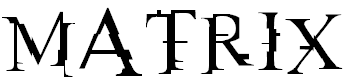

Type the falling words as fast as you can and don't let them reach the
edge of your screen. The more letters you shoot of, the higher your score
will be.

### Reasoning

I found [ztype](http://phoboslab.org/ztype/) here the other day and I
wanted to have a go at making something similar in C#. This is my first
project in C#, so there's probably a lot of room for improvement. Please
let me know by posting an issue if your into this sort of thing.

### Installation (MacOS)

To install on MacOS you will need to have
[Mono MDK](http://mono-project.com/) installed.

    $ git clone https://github.com/hkjels/matrix
    $ make
    $ make install

### Usage

    $ matrix

